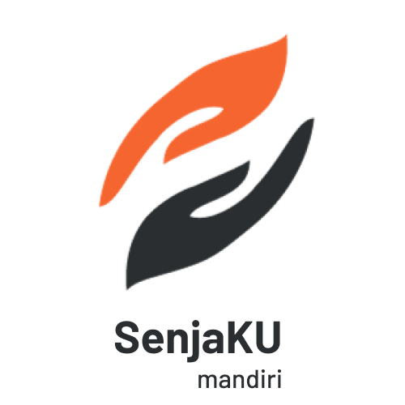

  

 

# Introduction
### Project Name
SenjaKU

### Description
SenjaKU is a digital banking application for seniors. The application is designed to be as simple as possible to be more seniors-*friendly* so that seniors are expected to be able and confident in accessing banking services easily, anywhere, and anytime according to their needs. This feature consists of:
- Transfer (Transfer dan QRIS)
- Tagihan (BPJS, Listrik, dan PDAM)
- Top Up (EWallet dan Pulsa)
- Biometrics (Fingerprint)

### Project Objectives
1. Create a digital bank application for seniors.
2. Creating an application that is easy for seniors to use for their needs.
3. Create an application that allows seniors to easily make transactions, manage retirement funds, monitor transaction activities, and more independently.

### Project Team
| Name | Job | 
|---|---|
| Muhammad Luthfi Jasir Yadri | Project Manager & Software Engineer |
| Ilham Muhammad Sakti | Software Engineer & UI/UX Designer |
| Berliana Putri Buwono | Business Analyst |
| Zahra Nur Alifah | Business Analyst |
| Irkham Muhammad Fakhri | UI/UX Designer |
| Elok Washilatul Fadhilah A.S. |  |
| Adenawati Hasim |  |
| Muhammad Ridho Nurul Ihsan |  |

### Project Start and End Dates
December 18, 2023 - January 25, 2024

# Design
### System Architecture
### User Interface Design
### Database Design

# Installation
### System Requirements
### Installation Guide
